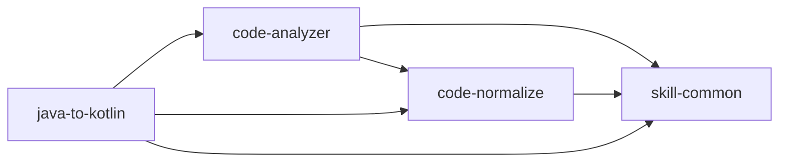

# 个人 Skills 目录

> 自动生成于 2026-07-08 20:28:37，由 github-manager 维护
> GitHub 账号：xjxlx

## 概览

| Skill | 用途 | 依赖 | 状态 | 最后更新 |
|---|---|---|---|---|
| [android-architecture](https://github.com/xjxlx/codex-skills/tree/main/android-architecture) | | | 无 | 已发布 | - |
| [code-analyzer](https://github.com/xjxlx/codex-skills/tree/main/code-analyzer) | 为指定 Java、Kotlin 文件梳理方法逻辑，添加详细中文方法注释，检测潜在 bug 和性能复杂度问题，并调用 code-normalize 完成成员... | code-normalize, skill-common | 已发布 | 2026-06-20 |
| [code-normalize](https://github.com/xjxlx/codex-skills/tree/main/code-normalize) | 检测并安全规范 Java、Kotlin 类中的成员变量命名，更新全部引用，补充缺失的类注释，并为关键成员添加作用说明；发现已启用 ViewBinding ... | skill-common | 已发布 | 2026-06-20 |
| [code-review](https://github.com/xjxlx/codex-skills/tree/main/code-review) | | | 无 | 已发布 | - |
| [compose-expert](https://github.com/xjxlx/codex-skills/tree/main/compose-skill) | > | 无 | 已发布 | - |
| [compose-ui](https://github.com/xjxlx/codex-skills/tree/main/compose-ui) | | | 无 | 已发布 | - |
| [github-manager](https://github.com/xjxlx/codex-skills/tree/main/github-manager) | 实现个人 Codex Skills 的变更检测、凭据扫描、GitHub 发布、目录维护和本地恢复。当用户要求检查发布状态、发布或更新 skill、扫描敏感... | 无 | 已发布 | 2026-06-20 |
| [hilt-di](https://github.com/xjxlx/codex-skills/tree/main/hilt-di) | | | 无 | 已发布 | - |
| [java-to-kotlin](https://github.com/xjxlx/codex-skills/tree/main/java-to-kotlin) | 将 Android 项目中的 Java 类转换为 Kotlin。用于将 Java 文件迁移到 Kotlin、用惯用 Kotlin 重写 Java 类、或现... | code-analyzer, code-normalize, skill-common | 已发布 | 2026-06-20 |
| [kotlin-patterns](https://github.com/xjxlx/codex-skills/tree/main/kotlin-patterns) | | | 无 | 已发布 | - |
| [performance](https://github.com/xjxlx/codex-skills/tree/main/performance) | | | 无 | 已发布 | - |
| [skill-common](https://github.com/xjxlx/codex-skills/tree/main/skill-common) | 作为个人 Skill 的强制基础规范，统一启动时变更检测与自动发布、中文输出、职责路由、依赖去重和持续进化。除明确声明例外的 Skill 外，每个个人 S... | 无 | 已发布 | 2026-06-20 |
| [systematic-debugging](https://github.com/xjxlx/codex-skills/tree/main/systematic-debugging) | Use when encountering any bug, test failure, or unexpected behavior, before p... | 无 | 已发布 | - |
| [test-driven-development](https://github.com/xjxlx/codex-skills/tree/main/test-driven-development) | Use when implementing any feature or bugfix, before writing implementation code | 无 | 已发布 | - |
| [writing-skills](https://github.com/xjxlx/codex-skills/tree/main/writing-skills) | Use when creating new skills, editing existing skills, or verifying skills wo... | 无 | 已发布 | - |

## 依赖关系

## 各 Skill 详情

### android-architecture

- **目录名**：`android-architecture`
- **用途**：|
- **依赖**：无
- **文件数**：15
- **UI 元数据**：缺少
- **路径**：`~/.codex/skills/android-architecture/`
- **仓库**：https://github.com/xjxlx/codex-skills/tree/main/android-architecture
- **状态**：已发布
- **最后更新**：-

### code-analyzer

- **目录名**：`code-analyzer`
- **用途**：为指定 Java、Kotlin 文件梳理方法逻辑，添加详细中文方法注释，检测潜在 bug 和性能复杂度问题，并调用 code-normalize 完成成员...
- **依赖**：code-normalize, skill-common
- **文件数**：3
- **UI 元数据**：缺少
- **路径**：`~/.codex/skills/code-analyzer/`
- **仓库**：https://github.com/xjxlx/codex-skills/tree/main/code-analyzer
- **状态**：已发布
- **最后更新**：2026-06-20

### code-normalize

- **目录名**：`code-normalize`
- **用途**：检测并安全规范 Java、Kotlin 类中的成员变量命名，更新全部引用，补充缺失的类注释，并为关键成员添加作用说明；发现已启用 ViewBinding ...
- **依赖**：skill-common
- **文件数**：5
- **UI 元数据**：有 agents/openai.yaml
- **路径**：`~/.codex/skills/code-normalize/`
- **仓库**：https://github.com/xjxlx/codex-skills/tree/main/code-normalize
- **状态**：已发布
- **最后更新**：2026-06-20

### code-review

- **目录名**：`code-review`
- **用途**：|
- **依赖**：无
- **文件数**：29
- **UI 元数据**：缺少
- **路径**：`~/.codex/skills/code-review/`
- **仓库**：https://github.com/xjxlx/codex-skills/tree/main/code-review
- **状态**：已发布
- **最后更新**：-

### compose-expert

- **目录名**：`compose-skill`
- **用途**：>
- **依赖**：无
- **文件数**：51
- **UI 元数据**：缺少
- **路径**：`~/.codex/skills/compose-skill/`
- **仓库**：https://github.com/xjxlx/codex-skills/tree/main/compose-skill
- **状态**：已发布
- **最后更新**：-

### compose-ui

- **目录名**：`compose-ui`
- **用途**：|
- **依赖**：无
- **文件数**：31
- **UI 元数据**：缺少
- **路径**：`~/.codex/skills/compose-ui/`
- **仓库**：https://github.com/xjxlx/codex-skills/tree/main/compose-ui
- **状态**：已发布
- **最后更新**：-

### github-manager

- **目录名**：`github-manager`
- **用途**：实现个人 Codex Skills 的变更检测、凭据扫描、GitHub 发布、目录维护和本地恢复。当用户要求检查发布状态、发布或更新 skill、扫描敏感...
- **依赖**：无
- **文件数**：23
- **UI 元数据**：有 agents/openai.yaml
- **路径**：`~/.codex/skills/github-manager/`
- **仓库**：https://github.com/xjxlx/codex-skills/tree/main/github-manager
- **状态**：已发布
- **最后更新**：2026-06-20

### hilt-di

- **目录名**：`hilt-di`
- **用途**：|
- **依赖**：无
- **文件数**：14
- **UI 元数据**：缺少
- **路径**：`~/.codex/skills/hilt-di/`
- **仓库**：https://github.com/xjxlx/codex-skills/tree/main/hilt-di
- **状态**：已发布
- **最后更新**：-

### java-to-kotlin

- **目录名**：`java-to-kotlin`
- **用途**：将 Android 项目中的 Java 类转换为 Kotlin。用于将 Java 文件迁移到 Kotlin、用惯用 Kotlin 重写 Java 类、或现...
- **依赖**：code-analyzer, code-normalize, skill-common
- **文件数**：5
- **UI 元数据**：有 agents/openai.yaml
- **路径**：`~/.codex/skills/java-to-kotlin/`
- **仓库**：https://github.com/xjxlx/codex-skills/tree/main/java-to-kotlin
- **状态**：已发布
- **最后更新**：2026-06-20

### kotlin-patterns

- **目录名**：`kotlin-patterns`
- **用途**：|
- **依赖**：无
- **文件数**：16
- **UI 元数据**：缺少
- **路径**：`~/.codex/skills/kotlin-patterns/`
- **仓库**：https://github.com/xjxlx/codex-skills/tree/main/kotlin-patterns
- **状态**：已发布
- **最后更新**：-

### performance

- **目录名**：`performance`
- **用途**：|
- **依赖**：无
- **文件数**：1
- **UI 元数据**：缺少
- **路径**：`~/.codex/skills/performance/`
- **仓库**：https://github.com/xjxlx/codex-skills/tree/main/performance
- **状态**：已发布
- **最后更新**：-

### skill-common

- **目录名**：`skill-common`
- **用途**：作为个人 Skill 的强制基础规范，统一启动时变更检测与自动发布、中文输出、职责路由、依赖去重和持续进化。除明确声明例外的 Skill 外，每个个人 S...
- **依赖**：无
- **文件数**：5
- **UI 元数据**：有 agents/openai.yaml
- **路径**：`~/.codex/skills/skill-common/`
- **仓库**：https://github.com/xjxlx/codex-skills/tree/main/skill-common
- **状态**：已发布
- **最后更新**：2026-06-20

### systematic-debugging

- **目录名**：`systematic-debugging`
- **用途**：Use when encountering any bug, test failure, or unexpected behavior, before p...
- **依赖**：无
- **文件数**：11
- **UI 元数据**：缺少
- **路径**：`~/.codex/skills/systematic-debugging/`
- **仓库**：https://github.com/xjxlx/codex-skills/tree/main/systematic-debugging
- **状态**：已发布
- **最后更新**：-

### test-driven-development

- **目录名**：`test-driven-development`
- **用途**：Use when implementing any feature or bugfix, before writing implementation code
- **依赖**：无
- **文件数**：2
- **UI 元数据**：缺少
- **路径**：`~/.codex/skills/test-driven-development/`
- **仓库**：https://github.com/xjxlx/codex-skills/tree/main/test-driven-development
- **状态**：已发布
- **最后更新**：-

### writing-skills

- **目录名**：`writing-skills`
- **用途**：Use when creating new skills, editing existing skills, or verifying skills wo...
- **依赖**：无
- **文件数**：7
- **UI 元数据**：缺少
- **路径**：`~/.codex/skills/writing-skills/`
- **仓库**：https://github.com/xjxlx/codex-skills/tree/main/writing-skills
- **状态**：已发布
- **最后更新**：-

---

共 **15** 个 skill，其中 **15** 个已发布，**0** 个未发布。
